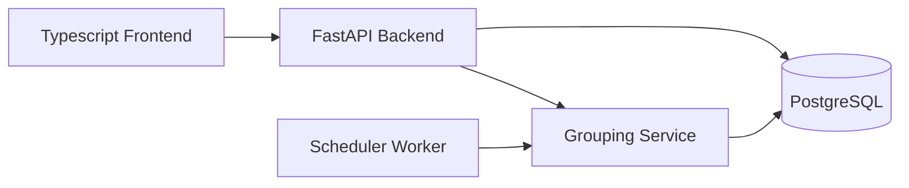
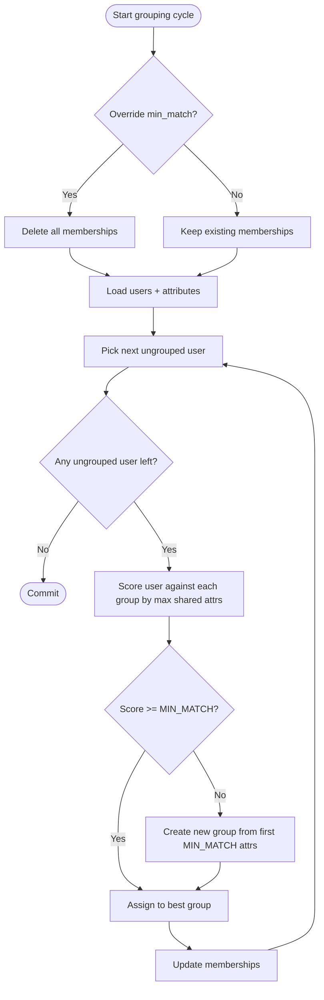
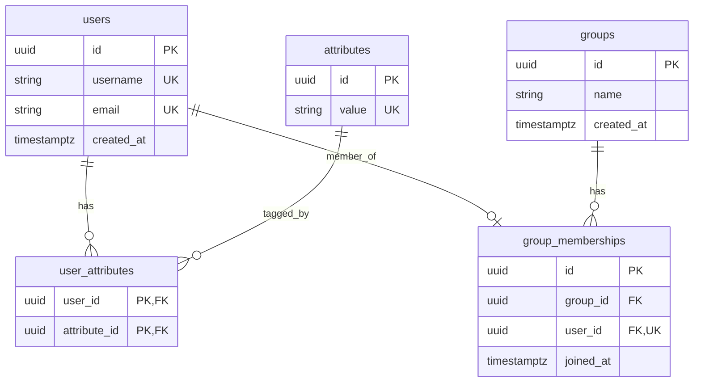

# Social Grouping Application

Repository: <https://github.com/EfeBallar/imec-assignment>

## 1) Solution Design

### 1.1 Proposed Solution

The solution is a containerized full-stack application with:

- **Backend**: FastAPI + SQLAlchemy + PostgreSQL
- **Frontend**: React + TypeScript
- **Background grouping**: APScheduler batch process (no real-time)

Users are created first, then attributes are managed separately. A periodic worker groups users by shared attributes using a configurable threshold (`MIN_MATCH`).

### 1.2 Architectural Approach and Reasoning

1. **Separated concerns**
   - API layer handles HTTP concerns (validation, status codes, routing).
   - Service layer handles grouping/domain logic.
   - ORM models define persistence rules and relationships.
   - Frontend consumes API only (no backend logic reimplemented in UI).

2. **Relational schema**
   - Many-to-many relationship between users and attributes through `user_attributes`.
   - One active membership per user through `group_memberships` unique constraint on `user_id`.
   - Referential integrity with foreign keys and cascades.

3. **Batch grouping for scale and throughput**
   - Grouping runs in periodic cycles rather than per-request matching.
   - This avoids expensive synchronous computations on user write paths.

4. **Configurable matching and regrouping**
   - Default `MIN_MATCH` comes from environment.
   - Manual override via `POST /api/grouping/run?min_match=...` triggers full regroup from scratch.

5. **Human-readable group naming**
   - Group names are generated from matched attributes, e.g. `belgium-intern`.
   - On override regroup, names are recalculated.

### 1.3 High-Level Architecture Diagram

### 1.4 Grouping Flowchart

### 1.5 Relational Data Model (ER Diagram)

---

## 2) Implementation

### 2.1 Backend Implementation

Key modules:

- `app/backend/main.py` - app bootstrap, DB startup wait, scheduler lifecycle, CORS
- `app/backend/api/routes.py` - REST endpoints
- `app/backend/services/grouping.py` - attribute normalization, grouping engine
- `app/backend/models.py` - ORM schema
- `app/backend/schemas.py` - API request/response models
- `app/backend/db/session.py` - SQLAlchemy engine/session dependency

Implemented REST endpoints:

- `POST /api/users`
- `GET /api/users`
- `GET /api/users/{user_id}`
- `PUT /api/users/{user_id}/attributes`
- `GET /api/users/{user_id}/attributes`
- `GET /api/users/{user_id}/group`
- `POST /api/grouping/run`
- `GET /health`

### 2.2 Frontend Implementation

Key modules:

- `app/frontend/src/App.tsx` - route shell and navigation
- `app/frontend/src/api.ts` - fetch-based API client
- `app/frontend/src/pages/UserCreationPage.tsx`
- `app/frontend/src/pages/AttributeManagementPage.tsx`
- `app/frontend/src/pages/GroupViewPage.tsx`
- `app/frontend/src/components/UserSelector.tsx`

UI pages:

1. **User creation**
2. **Attribute management** (supports multi-value comma input, add/remove)
3. **Group view** (group name + members + member attributes)

### 2.3 Best Practices

- Input validation through Pydantic models and query constraints
- Layered backend architecture (routes/services/models)
- Database constraints for uniqueness and referential integrity
- Idempotent background grouping cycles
- Unit/integration tests for routes, services, and DB behavior
- Environment-based configuration (`.env`)
- Containerized local execution (`docker-compose.yml`)

---

## 3) Testing and Evaluation

### 3.1 Testing Process

Backend tests (`pytest`) cover:

- **Route tests**: success paths, validation failures, not-found behavior, override regroup behavior
- **Service tests**: normalization, assignment logic, full regroup behavior, group naming behavior
- **Model tests**: schema creation, unique constraints, relational consistency

Frontend validation:

- TypeScript compilation and production build via `npm run build`

### 3.2 Results Summary

- Backend: `29 passed`
- Frontend: build successful

This confirms core requirements are implemented and functioning as expected in local development.

### 3.3 Limitations

Current limitations include:

1. **No authentication/authorization** (any client can create/update/read users)
2. **No migration framework** (schema is ORM/DDL based; no Alembic migration history yet)
3. **No pagination/filtering** for user listing/group retrieval
4. **Single-process scheduler model** (distributed worker strategy not yet implemented)

### 3.4 Potential Improvements

1. Add JWT/session-based auth and role checks
2. Add Alembic migrations for production-safe schema evolution
3. Add caching, API pagination
4. Introduce queue-based background workers for horizontal scale
